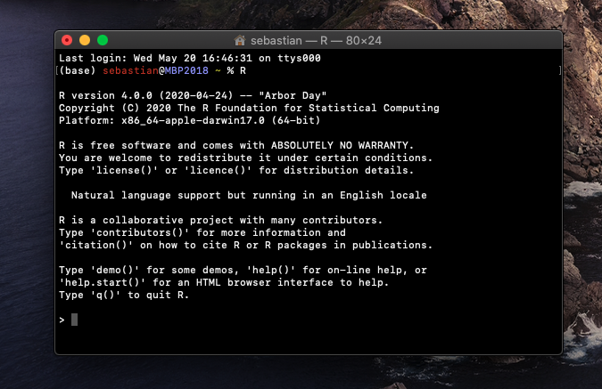
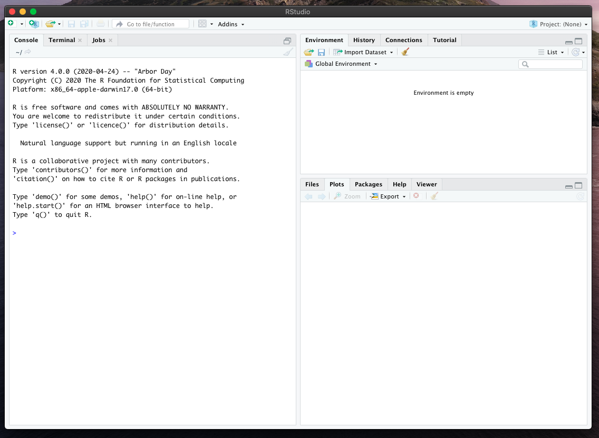
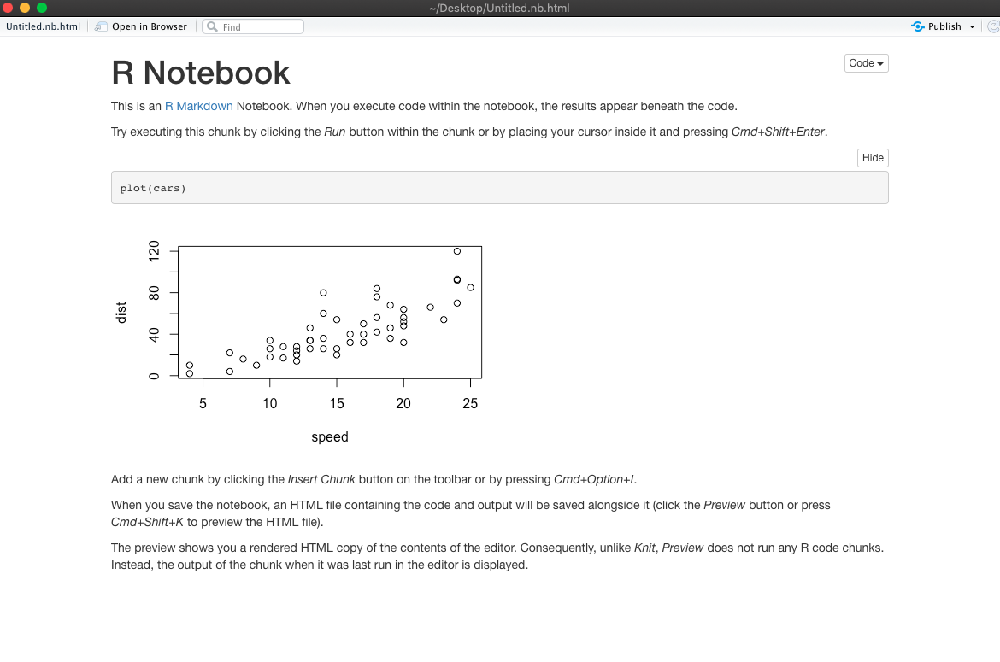
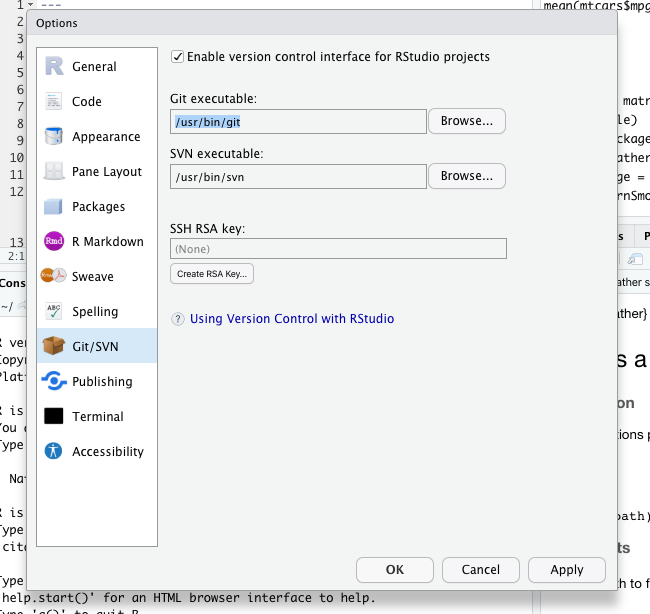

# About R

- R is a programming language that is commonly used for statistical analyses and plotting.
- R was created more than 30 years ago, publicly announced in 1993, by Ross Ihaka and Robert Gentleman -- it's first public version is only 3 years younger than Python.
- Originally, R was developed as a version (or "dialect") of the statistical environment language called "S," developed by John Chambers et al. at Bell Labs in the 1970s.
- The design focus of R is centered around and targeted at the user rather than the programmer -- primarily, it aims to equip the user with tools for statistical analyses; however, it also allows users to program custom functionality if necessary.
- Being a Python and C programmer, I personally see R more as an environment for statistical analysis (versus application development), whereas Python is more of a general purpose language.
- While Python is becoming more and more popular in various scientific computing-related fields (especially machine learning and deep learning), R is still a widely used language in data science. This is likely because there are many R libraries and packages for statistical computing and analysis that are not available through Python (yet).
- Similar to Python and other languages, R is open source and free to use.
- Since web-searching R can be a bit difficult using just that one letter, we usually refer to "R" as "R lang" in such contexts.

# Installing R

- R, and various additional R packages we are using, are available from the Comprehensive R Archive Network (CRAN).
- Since any external installation guides may become obsolete rather sooner than later, I recommend visiting https://cran.r-project.org and following the official installation tutorials on there.
- When you visit https://cran.r-project.org, you will find installation guides for all major operating systems: Linux, macOS, and Windows.
- If you are using macOS or Linux, you can double-check your installation by executing "R" in the command line terminal:
  

- Note that if you share analyses or ask questions about certain behaviors or bugs in R, I highly recommend including the output of the `sessionInfo()` command, which prints some basic information about your environment:

# Installing RStudio

- While the default R package should provide you with all the computing capabilities you need, the RStudio integrated development environment (IDE) may provide you with a more user-friendly interface to R -- you can think of it as a fancy text editor for writing your code.
- Caution: You need to install R first before you can install R Studio.
- What makes RStudio particularly useful is that it provides you with a graphical user interface that not only allows you to write code but also lets you run code and view plots side-by-side, which some people prefer.
- The RStudio IDE is developed but the RStudio company, however, they offer a free basic version that you can install on a laptop or desktop computer. The download page and instructions are available at https://rstudio.com/products/rstudio/.

- One of my favorite features of RStudio is working with R Notebook, since it allows interleaving Markdown text (for note taking), R code, and plots. To open a new R Notebook, click on "New File" in the upper left corner and select "R Notebook." (When you open an R Notebook for the first time, click "Yes" when it prompts you to install the required packages.)

- Clicking on the previous button will render a nice version of this notebook that you can later share with others:

- Note that the note/tutorial files in this GitHub repository are itself RStucdio R Markdown (.Rmd) files. To find out more about hosting R Markdown files on GitHub, please see [https://rmarkdown.rstudio.com/github_document_format.html](https://rmarkdown.rstudio.com/github_document_format.html).

# (Optional) Linking RStudio and GitHub

- Open RStudio; then, click on `Tools` in the menu bar; select "Git/SVN" from the menu on the left.
- In the Git/SVN menu, make sure that "Enable version control interface for RStudio projects is checked" doublecheck that the link to the "Git executable" is correct:

- Next, click on "Create RSA key" and confirm the next menu with "Create." The passphrase is optional.

- Then, click "View puplic key" and copy that key to your clipboard. We are going to enter it on GitHub next.

- Go to your GItHub account, open the settings, and click on "SSH and GPG keys". In the menu to the right, click on "New SSH key" and paste in the copied key.
- Now, the next time you create a "New Project" in RStudio, you can use the "Git" option to link an existing repository from your GitHub account.

# Installing R Packages

- Additional, usually more specialized functions that are not included in the basic installation of R.
- The two main repositories where you can find R packages are CRAN (https://cran.r-project.org) and GitHub (https://github.com).
- To install packages from CRAN, you can either.
  - Click on Tools -> Install Packages ... in RStudio.
  - Install a packages from the console/terminal. For example, to install the package feather, execute `install.packages("feather")`.
- To use a package after installing it, we need to load it in our current R session. To do so, use the library function, e.g., `library(feather)`.
- To update packages, you can use `update.packages()` to update all packages. Or, run `install.packages("feather")`  to update a specific package.
- Use the `help` function to get more information about a package. For example, `help(package = "feather")`.