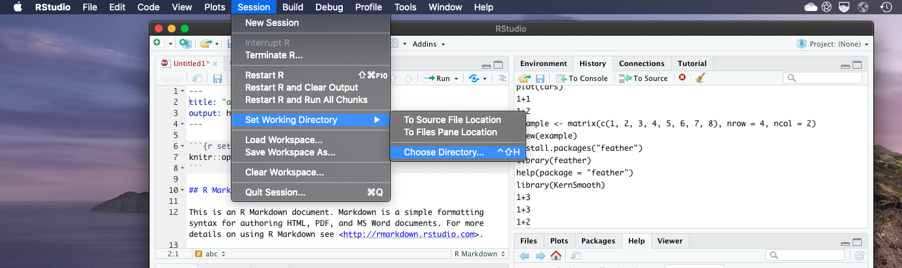
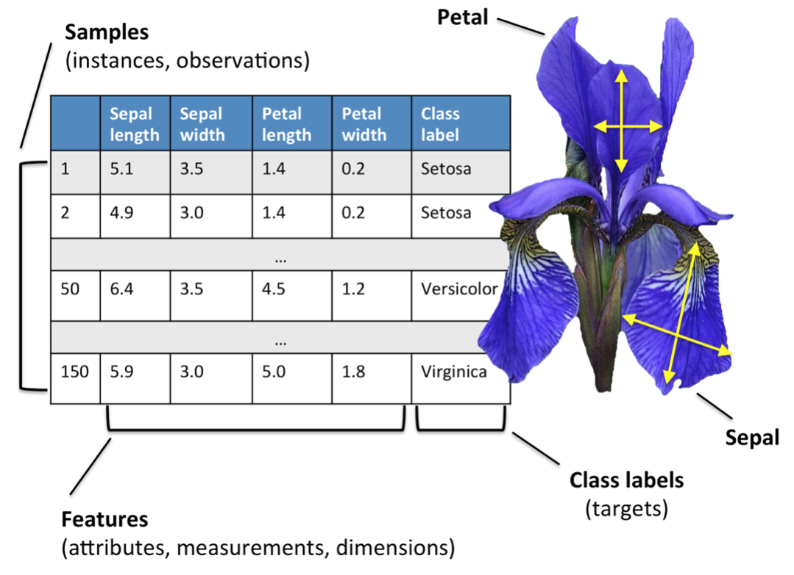

Source file: https://github.com/rasbt/R-notes/blob/master/03-reading-data-files.Rmd

# File Reading Basics

- If your CSV file is in your working directory (you can display your working directory path by executing `getcwd()`), you can load it via

    read.csv('myfile.csv')

- However, if the CSV file you want to read is not in your current working directory, this command will fail. If this is personal code that you are not intending on sharing with anyone else, it doesn't hurt to provide the full path; for example, 

    read.csv('/Users/sebastian/Data/myfile.csv')

- For your convenience, you could also just change your working directory path. Both the default R app and R Studio app have options for that:


# Tabular Data

## read.table

- Most of the time, when we use R, we are working with datasets that have been preprocessed into a tabular for; often, this tabular data is saved as a CSV file (where CSV stands for comma separated values).
- A relatively universal function for loading CSV files into an R session is the `read.table()` function. 
- You can get detailed information about the `read.table` function by executing `help(read.table)` or visiting the documentation website at https://www.rdocumentation.org/packages/utils/versions/3.6.2/topics/read.table
- Here, we are going to focus on the basics, which are the following (including their defaults), but I recommend reading the (short) documentation mentioned above so that you know the other important options, which you will need rather sooner than later in your everyday practice when working with real-world data.

```
read.table(file, header = FALSE, sep = "", ...
```
The function arguments are as follows:
  - `file`: the path to the file you want to read
  - `header`: a TRUE or FALSE value denoting whether your file has column names provided in the file
  - `sep`: defines how the different data columns are separated
  
  
- Below, we are going to use the `read.table()` function on a simple example dataset, the Iris dataset collected by Edgar Anderson and first published in 

> R. A. Fisher (1936). "The use of multiple measurements in taxonomic problems". Annals of Eugenics. 7 (2): 179–188. doi:10.1111/j.1469-1809.1936.tb02137.x. hdl:2440/15227.
  
- The Iris dataset contains the leaf-size measurements (sepal length and width, and petal length and width) of 3 different Iris flower species (Iris-Setosa, Iris-Versicolor, and Iris-Virginica). 



- I've put an example of this file into the as `iris.csv` into the `./data` folder. If you open it in a text file, it looks like this:
  
```150,4,setosa,versicolor,virginica
5.1,3.5,1.4,0.2,0
4.9,3.0,1.4,0.2,0
4.7,3.2,1.3,0.2,0
4.6,3.1,1.5,0.2,0
...
5.9,3.0,5.1,1.8,2
```
- In this case, the first line is not a column header but a line provides some general information about the dataset, saying that it has 150 rows (flower entries), 4 features columns (sepal length and width in cm, and petal length and width in cm). 
- The last column is an integer column that contains values 0 (=setosa), 1 (=versicolor), 2 (=virginica).
- Let's read in the file into an R dataframe using the `read.table()` function. In addition to the previously discussed function arguments, we are going to set `skip = 1`, which means that it will skip the first line in the dataset (because here, it is just a dataset summary):

```{r}
df <- read.table(file = 'data/iris.csv', header = FALSE, sep = ',', skip = 1)
df
```
- Optionally, you can also manually assign column names using the `col.names` attribute:

```{r}
column_names <- c("sepal length", "sepal width", "petal length", "petal width", "species")
df <- read.table(file = 'data/iris.csv', sep = ',', skip = 1, col.names = column_names)
df
```

- After looking at the basic example, it would now be a good idea to briefly read through the other arguments available for `read.table()`, which you may have to use rather sooner than later. Here's a complete list of these arguments:


**file**  	
 the name of the file which the data are to be read from. Each row of the table appears as one line of the file. If it does not contain an absolute path, the file name is relative to the current working directory, getwd(). Tilde-expansion is performed where supported. This can be a compressed file (see file).

 Alternatively, file can be a readable text-mode connection (which will be opened for reading if necessary, and if so closed (and hence destroyed) at the end of the function call). (If stdin() is used, the prompts for lines may be somewhat confusing. Terminate input with a blank line or an EOF signal, Ctrl-D on Unix and Ctrl-Z on Windows. Any pushback on stdin() will be cleared before return.)

 file can also be a complete URL. (For the supported URL schemes, see the ‘URLs’ section of the help for url.)

**header**  	
a logical value indicating whether the file contains the names of the variables as its first line. If missing, the value is determined from the file format: header is set to TRUE if and only if the first row contains one fewer field than the number of columns.

**sep**  	
the field separator character. Values on each line of the file are separated by this character. If sep = "" (the default for read.table) the separator is ‘white space’, that is one or more spaces, tabs, newlines or carriage returns.

**quote**  	
the set of quoting characters. To disable quoting altogether, use quote = "". See scan for the behaviour on quotes embedded in quotes. Quoting is only considered for columns read as character, which is all of them unless colClasses is specified.

**dec**  	
the character used in the file for decimal points.

**numerals**  	
string indicating how to convert numbers whose conversion to double precision would lose accuracy, see type.convert. Can be abbreviated. (Applies also to complex-number inputs.)

**row.names**  	
a vector of row names. This can be a vector giving the actual row names, or a single number giving the column of the table which contains the row names, or character string giving the name of the table column containing the row names.

If there is a header and the first row contains one fewer field than the number of columns, the first column in the input is used for the row names. Otherwise if row.names is missing, the rows are numbered.

Using row.names = NULL forces row numbering. Missing or NULL row.names generate row names that are considered to be ‘automatic’ (and not preserved by as.matrix).

**col.names**  	
a vector of optional names for the variables. The default is to use "V" followed by the column number.

**as.is**  	
controls conversion of character variables (insofar as they are not converted to logical, numeric or complex) to factors, if not otherwise specified by colClasses. Its value is either a vector of logicals (values are recycled if necessary), or a vector of numeric or character indices which specify which columns should not be converted to factors.

Note: to suppress all conversions including those of numeric columns, set colClasses = "character".

Note that as.is is specified per column (not per variable) and so includes the column of row names (if any) and any columns to be skipped.

**na.strings**  	
a character vector of strings which are to be interpreted as NA values. Blank fields are also considered to be missing values in logical, integer, numeric and complex fields. Note that the test happens after white space is stripped from the input, so na.strings values may need their own white space stripped in advance.

**colClasses**  	
character. A vector of classes to be assumed for the columns. If unnamed, recycled as necessary. If named, names are matched with unspecified values being taken to be NA.

Possible values are NA (the default, when type.convert is used), "NULL" (when the column is skipped), one of the atomic vector classes (logical, integer, numeric, complex, character, raw), or "factor", "Date" or "POSIXct". Otherwise there needs to be an as method (from package methods) for conversion from "character" to the specified formal class.

Note that colClasses is specified per column (not per variable) and so includes the column of row names (if any).

**nrows**  	
integer: the maximum number of rows to read in. Negative and other invalid values are ignored.

**skip**  	
integer: the number of lines of the data file to skip before beginning to read data.
*
**check.names**  	
logical. If TRUE then the names of the variables in the data frame are checked to ensure that they are syntactically valid variable names. If necessary they are adjusted (by make.names) so that they are, and also to ensure that there are no duplicates.

**fill**  	
logical. If TRUE then in case the rows have unequal length, blank fields are implicitly added. See ‘Details’.

**strip.white**  	
logical. Used only when sep has been specified, and allows the stripping of leading and trailing white space from unquoted character fields (numeric fields are always stripped). See scan for further details (including the exact meaning of ‘white space’), remembering that the columns may include the row names.

**blank.lines.skip**  	
logical: if TRUE blank lines in the input are ignored.

**comment.char**	
character: a character vector of length one containing a single character or an empty string. Use "" to turn off the interpretation of comments altogether.

**allowEscapes**	
logical. Should C-style escapes such as \n be processed or read verbatim (the default)? Note that if not within quotes these could be interpreted as a delimiter (but not as a comment character). For more details see scan.

**flush**  	
logical: if TRUE, scan will flush to the end of the line after reading the last of the fields requested. This allows putting comments after the last field.

**stringsAsFactors**  	
logical: should character vectors be converted to factors? Note that this is overridden by as.is and colClasses, both of which allow finer control.

**fileEncoding**  
character string: if non-empty declares the encoding used on a file (not a connection) so the character data can be re-encoded. See the ‘Encoding’ section of the help for file, the ‘R Data Import/Export Manual’ and ‘Note’.

**encoding**  
encoding to be assumed for input strings. It is used to mark character strings as known to be in Latin-1 or UTF-8 (see Encoding): it is not used to re-encode the input, but allows R to handle encoded strings in their native encoding (if one of those two). See ‘Value’ and ‘Note’.

**text**  
character string: if file is not supplied and this is, then data are read from the value of text via a text connection. Notice that a literal string can be used to include (small) data sets within R code.

**skipNul**  	
logical: should nuls be skipped?

## read.csv

- Note that there is also a `read.csv()` function; it is the same as the `read.table()` function, except that 
  - it uses the default value `sep=","` instead of `sep=""` (i.e., the default column separator is a comma instead of a white space).
  - it uses the default value `header="TRUE"` instead of `header="FALSE"` 
- In practice, it does not make any difference whether you use `read.table` or `read.csv` given that you specify the corresponding function arguments correctly.
- Below is an example showing how to use the read the previous `iris.csv` file using the `read.csv()` function:

```{r}
df <- read.csv(file = 'data/iris.csv', header = FALSE, skip = 1, col.names = column_names)
df
```

## Writing files

- `write.table()`, `write.csv()`


# Plain Text Data

- `readLines()`
- `writeLines()`

# Loading Workspaces


`load()`
`dump()`

# Binary Files

`unserialize()`
`serialize()`