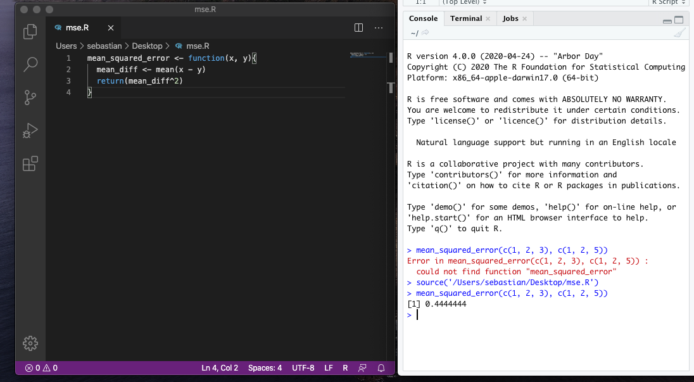

06 – Functions
================
Sebastian Raschka
6/17/2020

Source file:
<https://github.com/rasbt/R-notes/blob/master/06-functions.Rmd>

# Functions

  - One of the cool aspects of R is that it comes with a large number of
    functions enabling scientific computing and statistical analyses out
    of the box.
  - However, sometimes, it is useful to define our own functions, such
    that we can reuse code more easily.

## Basic Function Syntax

  - Functions are created using `function()`.
  - Note that in contrast to Python, R doesn’t require an explicit
    `return` call – if `return` is not used, the R function will return
    the output of its last expression (Python will return `None` if no
    return call is used). For instance, the following two code snippets

<!-- end list -->

``` r
mean_squared_error <- function(x, y){
  mean_diff <- mean(x - y)
  mean_diff^2
}

mean_squared_error(c(1, 2, 3), c(1, 2, 5))
```

    ## [1] 0.4444444

and

``` r
mean_squared_error <- function(x, y){
  mean_diff <- mean(x - y)
  return(mean_diff^2)
}

mean_squared_error(c(1, 2, 3), c(1, 2, 5))
```

    ## [1] 0.4444444

both return `0.4444444`

## Saving and Loading Functions

  - For your convenience, you can save functions in a separate file and
    load it into your current R session. E.g., you can save the
    `mean_squared_error` we created above as a .R file, for example,
    `mse.R`. Then, you can source the file in your current R session to
    load the function, a shown in the screenshot below:



## Function Parameters and Arguments

  - Now that we have seen how basic functions work, let’s dive into some
    of the terminology.
  - In programming, we call the configuration options of a function
    “parameters” and the actual values provided to that function
    “arguments.” To provide an example, let’s revisit the mean squared
    error function from earlier:

<!-- end list -->

``` r
mean_squared_error <- function(x, y){
  mean_diff <- mean(x - y)
  mean_diff^2
}

mean_squared_error(c(1, 2, 3), c(1, 2, 5))
```

    ## [1] 0.4444444

  - In the function above, `x` and `y` are the parameters of the
    function. Then, we call the function providing the arguments
    `c(1, 2, 3)` (for parameter `x`) and `c(1, 2, 5)` (for parameter
    `y`).
  - R uses named parameters, and they support assigning default values.
    To illustrate this, have a look at the example below:

<!-- end list -->

``` r
some_func <- function(a = 'H', b = 'ello')
  cat(a, b, '\n')

some_func()
```

    ## H ello

``` r
some_func(a = 'C')
```

    ## C ello

``` r
some_func(b = 'i')
```

    ## H i

  - As you have probably already garnered from the example above, the
    arguments can be provided by name or positionally:

<!-- end list -->

``` r
some_func(a = 'C', b = 'old')
```

    ## C old

``` r
some_func(b = 'old', a = 'C')
```

    ## C old

``` r
some_func('C', 'old')
```

    ## C old

  - Personally, my recommendation is that if you are using functions
    with more than 1 parameter, it is usually a good idea to be explicit
    about the parameter names when providing function arguments (and
    this way, you also don’t have to memorize the order).

  - Also, oftentimes it is helpful to provide default arguments whenever
    it is reasonable. It helps users to get a better idea of what the
    input arguments look like, but it also can be used to provide
    reasonable recommendations. Note that you can also provide default
    values for some function arguments but not for others. Below is an
    example of a simple standardization function that standardizes a
    vector (such that it has zero mean and unit variance afterwards);
    the optional `na.rm` parameter is used to determine whether NA
    values should be removed via the `mean` and `sd` functions used
    inside the `standardize` function:

<!-- end list -->

``` r
standardize <- function(x, na.rm = TRUE) {
  (x - mean(x, na.rm = na.rm)) / sd(x, na.rm = na.rm)
}

vec <- c(1.1, 5.2, 2.1, 1.2, NA)
standardize(vec)
```

    ## [1] -0.6770588  1.4582806 -0.1562443 -0.6249774         NA

``` r
standardize(vec, na.rm = FALSE)
```

    ## [1] NA NA NA NA NA

  - Note that within the R community, parameters are called “formal
    arguments,” and there is a `formals()` function, that prints all the
    parameters (formal arguments) of a function for your convenience:

<!-- end list -->

``` r
formals(standardize)
```

    ## $x
    ## 
    ## 
    ## $na.rm
    ## [1] TRUE

  - A slightly more readable way to show function arguments is through
    using `args()`:

<!-- end list -->

``` r
args(standardize)
```

    ## function (x, na.rm = TRUE) 
    ## NULL

## “…” Arguments

  - Recall the function we created above to standardize data

<!-- end list -->

``` r
standardize <- function(x, na.rm = TRUE) {
  (x - mean(x, na.rm = na.rm)) / sd(x, na.rm = na.rm)
}

vec <- c(1.1, 5.2, 2.1, 1.2, NA)
standardize(vec)
```

    ## [1] -0.6770588  1.4582806 -0.1562443 -0.6249774         NA

  - Notice that we pass the `na.rm` argument on two the two other
    functions inside, i.e., `mean` and `sd`.
  - Sometimes, we want to pass a series of arguments to a function, and
    in this case, it can be more convenient to use the `...` operator or
    argument.
  - You can think of the `...` argument as a placeholder for an
    arbitrary number of arguments. For simplicity, the following
    modified `standardization` function only passes one argument via
    `...`, but it can hold multiple (arbitrary arguments):

<!-- end list -->

``` r
standardize2 <- function(x, ...) {
  (x - mean(x, ...)) / sd(x, na.rm = ...)
}

vec <- c(1.1, 5.2, 2.1, 1.2, NA)
standardize2(vec) # note that na.rm = FALSE by default in mean() and sd()
```

    ## [1] NA NA NA NA NA

``` r
standardize2(vec, na.rm = TRUE)
```

    ## [1] -0.6770588  1.4582806 -0.1562443 -0.6249774         NA

## Function Documentation

## Importing Code

`source()`

## Developing R Packages

  - If you are interested in developing your own R packages (also known
    as “extensions”), have a look at the official guide available at
    <https://cran.r-project.org/doc/manuals/r-release/R-exts.html>.

# Vectorization
