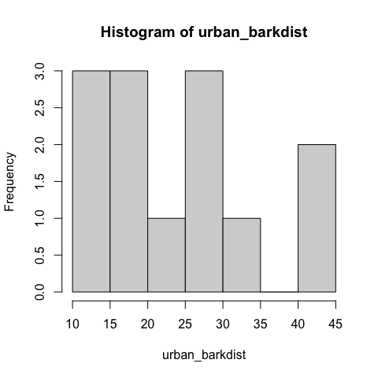
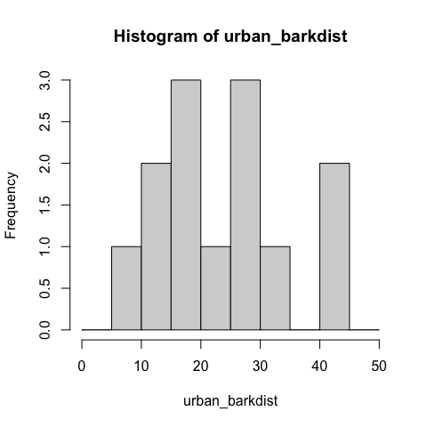
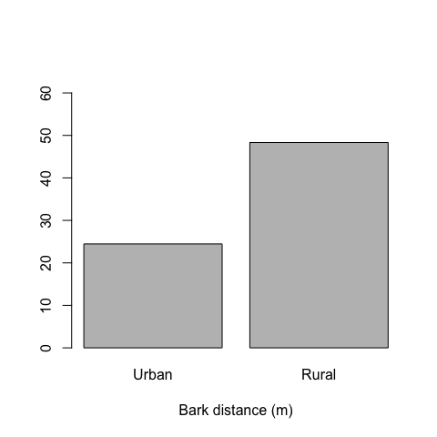
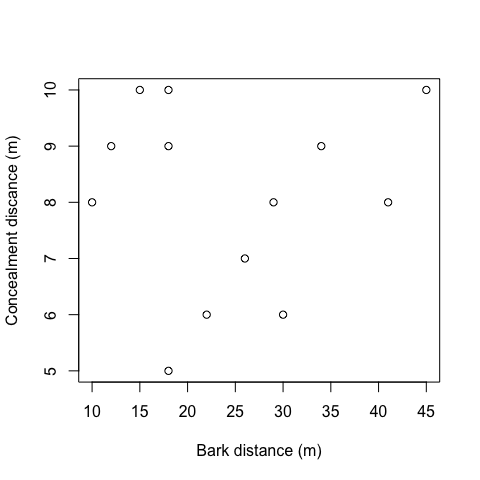
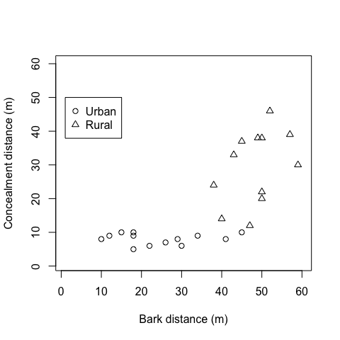

07 – Plotting
================
Sebastian Raschka
6/17/2020

-   [Plotting](#plotting)
    -   [Stem-and-Leaf plots](#stem-and-leaf-plots)
    -   [Histograms](#histograms)
    -   [Barplot](#barplot)
    -   [Scatterplots](#scatterplots)
    -   [Boxplots](#boxplots)

Source file:
<a href="https://github.com/rasbt/R-notes/blob/master/07-plotting.Rmd" class="uri">https://github.com/rasbt/R-notes/blob/master/07-plotting.Rmd</a>

Plotting
========

-   There are several different plotting libraries available in R. Here,
    we are going to focus on the built-in plotting capabilities
    (interested users may want to take a look at `ggplot2`, which is a
    popular plotting library some users prefer. You can find more
    information about it at
    <a href="https://ggplot2.tidyverse.org" class="uri">https://ggplot2.tidyverse.org</a>)

Stem-and-Leaf plots
-------------------

-   The example dataset used here contains information about the bark
    and concealment distances (in meters) of rural and urban prairie
    dogs:

-   Stem-and-leaf plots ar probably the simplest type of plot, and we
    could construct it conveniently by hand for small dataset if we had
    to.

-   using the `stem` function, we can construct the stem-and-leaf plot
    in R as followes.

<!-- -->

    urban_barkdist <- c(29, 10, 15, 41, 18, 18, 12, 45, 34, 30, 22, 26, 18)
    urban_concealdist <- c(8, 8, 10, 8, 9, 10, 9, 10, 9, 6, 6, 7, 5)
    rural_barkdist <- c(40, 47, 38, 59, 45, 52, 57, 50, 50, 49, 50, 43)
    rural_concealdist <- c(14, 12, 24, 30, 37, 46, 39, 22, 38, 38, 20, 33)

    stem(urban_barkdist)

    ## 
    ##   The decimal point is 1 digit(s) to the right of the |
    ## 
    ##   1 | 025888
    ##   2 | 269
    ##   3 | 04
    ##   4 | 15

-   The left most digit (before the “\|”) is the first digit of the
    values in the dataset. The values next to the stem represent the
    second digit of the values shown there. in the case of the
    `urban_barkdist` variable, we have 10, 12, 15, 18, 18, 18 (sorted in
    ascending order) for the first row, which become `1 | 025888`
-   This type of plot provides us with a quick view of the distribution
    of the data. In the example above, we have a right-skewed
    distribution (the tail is to the right.)

Histograms
----------

    hist(urban_barkdist)

<!-- -->

    hist(urban_barkdist, breaks=seq(0, 50, by = 5))

<!-- -->

Barplot
-------

    barplot(c(mean(urban_barkdist), mean(rural_barkdist)),
            xlab="Bark distance (m)",
            names.arg=c("Urban", "Rural"),
            ylim=c(0, 65))

<!-- -->

Scatterplots
------------

    plot(urban_barkdist, urban_concealdist,
         xlab="Bark distance (m)",
         ylab="Concealment discance (m)")

<!-- -->

    plot(urban_barkdist, urban_concealdist,
         xlim=range(1, 60), 
         ylim=range(1, 60),
         xlab='Bark distance (m)', 
         ylab='Concealment distance (m)');
    points(rural_barkdist, rural_concealdist, pch=2)
    legend(1, 50, pch=1:2, legend=c("Urban", "Rural"))

<!-- -->

Boxplots
--------
