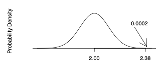

```{r setup, include=FALSE}
knitr::opts_chunk$set(echo = TRUE)
```

## Z-test --for Normal Population with Known Population Variance $\sigma^2$

**Context**

- use this test when testing a single sample (size `n`) against a reference population
- test assumes that the population from which the sample data was drawn from is normal distributed
- test assumes population variance of sample data is same as variance of ref population, $\sigma^2_1 = \sigma^2_{ref}$

**Steps**

0. Specify alpha level, e.g., $\alpha=0.05$

1. Formulate null hypothesis, $H_0: \mu = \mu_{ref}$, this means that the mean of the samples' population is the same as the mean of the reference population

2. Formulate alternative hypothesis:

    - one-sided, upper-tail. $H_A: \mu > \mu_{ref}$
    - one-sided, lower-tail: $H_A: \mu < \mu_{ref}$
    - two-sided: $H_A: \mu \neq \mu_{ref}$


3. Compute z-statistic: $z=\frac{\bar{x}-\mu}{\sigma_1 / \sqrt{n}}$

4. Look up p-value for the z value, corresponding to the alternative hypothesis 
    - $H_A: \mu > \mu_{ref}$: use $P(Z > z | H_0)$
    - $H_A: \mu < \mu_{ref}$: use $P(Z < z | H_0)$
    - $H_A: \mu \neq \mu_{ref}$: use $2*P(Z > |z| | H_0)$
    
    
**Example**

- Question: Is Minnesota Secchi depth (a lake clarity measurement) larger than Wisconsin?
- Given information (provided in the question)
  - Wisconsin (population); the reference to test the sample against: 
    - population normal distributed, $X_W \sim N(\mu_W, \sigma^2_W)$ 
    - population mean & variance, $\mu_W = 2.0$, $\sigma_W^2 = 0.25$
  - Minnesota; the sample that we want to test against Wisconsin population: 
    - sample mean, $\bar{X}_M = 2.38$, 
    - sample size $n=22$
- Formulate
  - Null hypothesis, $H_0: \mu_M = \mu_W$ or $H_0: \mu_M = 2.0$
  - Alt. hypothesis (here one sided): $H_A: \mu_M > 2.0$
- Assumptions:
  - Minnesota lakes normal distributed: $X_M \sim N(\mu_M, \sigma^2_M)$
  - Minnesota sample mean is normal distributed $\bar{X}_M \sim N(\mu_M, \frac{\sigma_M^2}{n})$
  - equal variance, $\sigma_M^2 = \sigma_W^2$; hence $\sigma_M^2 = 0.25$

$$P\left(\bar{X} \geq 2.38 \mid H_{0}\right)=P\left(\frac{\bar{X}_M-\mu_W}{\sqrt{\sigma_M^2/n}} \geq \frac{2.38-2.0}{0.1066}\right)=P(Z \geq 3.56)=0.0002$$
- assuming $\alpha=0.05$, we can reject the null hypothesis that the Wisconsin and Minnesota lake depths are the same



```{r}

# Given (change based on question)
sample_mean <- 2.38
pop_mean <- 2.00
pop_var <- 0.25
n <- 22

# Assumed & calculated (don't change this)
pop_mean_of_sample <- pop_mean # from null hypothesis
pop_var_of_sample <- pop_var # from equal variance assumption
sample_mean_var <- pop_var_of_sample / n
sample_mean_std_dev <- sqrt(sample_mean_var)

# z-value
z <- (sample_mean - pop_mean_of_sample ) / sample_mean_std_dev
cat('z:', z, '\n')

# p-value (change for one-sided upper/lower, two-tailed)
p <- pnorm(z, mean = 0, sd = 1, lower.tail = F)
# lower: p <- pnorm(z, mean = 0, sd = 1, lower.tail = T)
# 2-sided: p <- 2*pnorm(abs(z), mean = 0, sd = 1, lower.tail = F)
cat('p-value, P(Z > z):', p)
```


## T-test -- for Normal Population with *Unknown* Population Variance $\sigma^2$

- TODO

## Approximate Z test -- for Non-Normal Population with Known or Unknown Population Variance $\sigma^2$

- TODO

## Confidence Intervals

- TODO